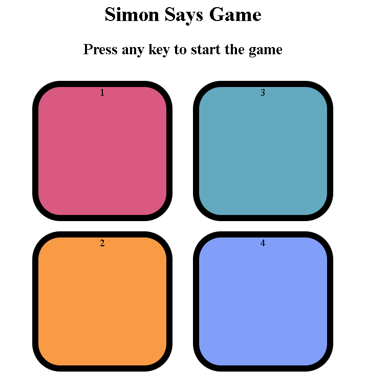

🎮 Simon Says Game

A fun, interactive memory challenge built with HTML, CSS, and JavaScript!
Test your brain — can you follow Simon’s color sequence without missing a beat?

---

🧠 About the Game

The Simon Says Game is a classic memory game where the computer flashes a sequence of colors, and the player has to repeat the sequence in the same order. Each correct round adds a new color, increasing the difficulty level step by step.

---

⚙️ Features

🎨 Colorful UI — four bright, responsive buttons.

🔊 Sound & Visual Feedback (optional to add in JS).

🚀 Progressive Difficulty — sequence grows after each level.

💡 Game Over Alert when you make a mistake.

📱 Fully Responsive — works on desktop and mobile.

---

🕹️ How to Play

Press any key (or click “Start”) to begin.

Watch carefully — Simon flashes a color sequence.

Repeat the exact same sequence by clicking the buttons.

With each successful round, the sequence gets longer.

One wrong move… and it’s Game Over! 😵

---

💡 Future Improvements

Add sound effects for each button press.

Introduce difficulty levels (easy / medium / hard).

Add score tracking and high-score leaderboard.

---

📸 Preview

